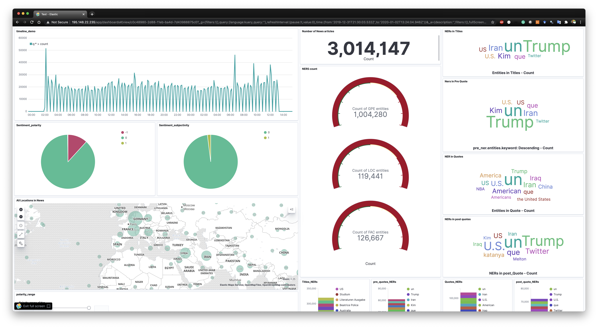

# waterfront-cityoptics

Project title: City Optics 

Submission for: #WaterFrontHack Global Online Hackathon organised by the H2020 CUTLER project https://www.cutler-h2020.eu/hackathon/
Name: Abhinay Pandya

email: Abhinay.Pandya@oulu.fi
Mentor: Dr. Panos Kostakos
Institution: University of Oulu, Finland

Abstract: In this era of data-driven governance and policy-design, officials need to generate insights from massive amounts of data posted/reported online. However, finding relevant data for policy design/assessment is challenging owing to the volume, variety, and verasity of the data across  societal topics, spaces, and places. Existing solutions tend to predominately focus on analyzing online social network data, news articles, blogs, and other crowd-sourced platforms. Project City Optics crawls and analyses textual data from the GDELT’s Quotation Graph which compiles quoted statements in worldwide news coverage. Quotations is an overlooked data source that can provide more authentic, credible and reliable information. City Optics employs  real time Machine Learning pipelines to crawl data, identify sentiment, locations, and named entities within and across quotations, and subsequently visualize the data through Kibana dashboard. Furthermore, it also enables an immersive VR display.

Video: https://www.youtube.com/watch?v=IiJXlneg6HM 

Kibana live Demo (tested in Chrome 86.0.4240.198 on MacOS): http://195.148.22.235/goto/e75bdd4deef138c18feafa5b2096cf17

The cluster is hosted in the CSC cPouta infra.

  

NOTE: If you are already using Kibana, you can import your pre-built Dashboards (expor.ndjson file), Searches and Visualizations. 
1. Go to Kibana
2. Click on Management
3. Click on Saved Objects
4. Click on the Import button
5. Browse the exported file
6. You will then be prompted: "If any of the objects already exist, do you want to automatically overwrite them?" and you will be given the following options:
No, prompt me for each one
Yes, overwrite all
