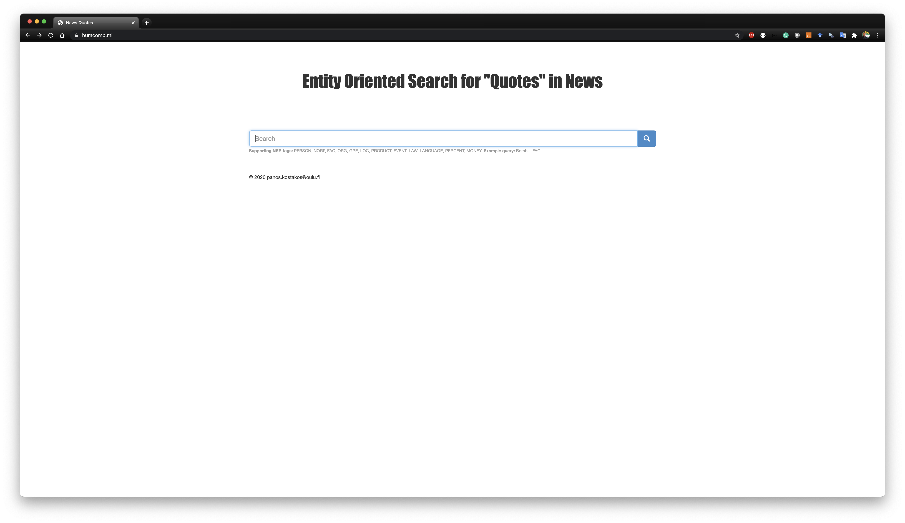
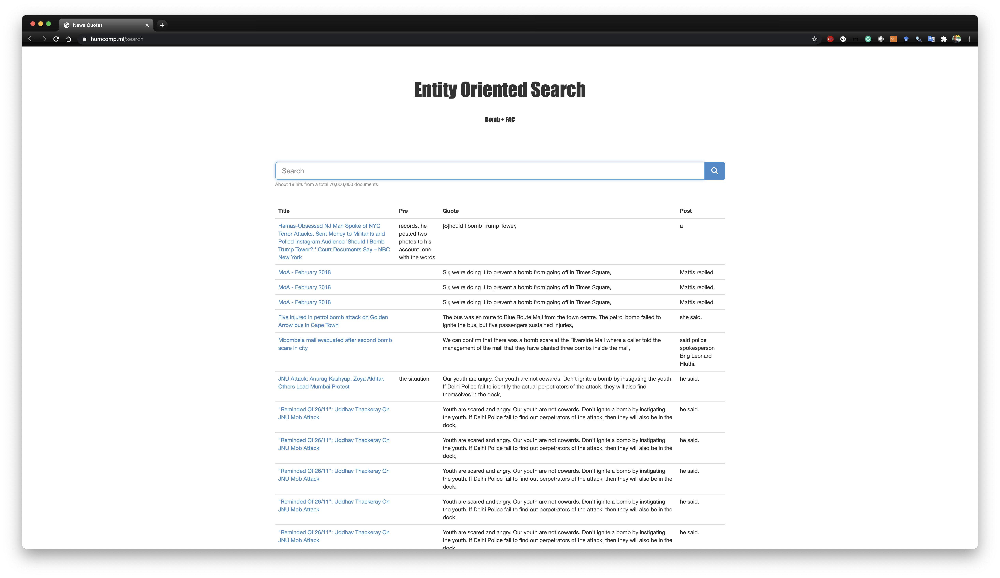

# waterfront-cityoptics

Project title: City Optics (For WaterFront hackaton: https://www.cutler-h2020.eu/hackathon/ )
Name: Abhinay Pandya
email: Abhinay.Pandya@oulu.fi
Mentor: Dr. Panos Kostakos
Institution: University of Oulu, Finland

Abstract: In this era of data-driven governance and policy-design, officials need to generate insights from massive amounts of data posted/reported online. However, finding relevant data for policy design/assessment is challenging owing to the volume, variety, and verasity of the data across  societal topics, spaces, and places. Existing solutions tend to predominately focus on analyzing online social network data, news articles, blogs, and other crowd-sourced platforms. Project City Optics crawls and analyses textual data from the GDELT’s Quotation Graph which compiles quoted statements in worldwide news coverage. Quotations is an overlooked data source that can provide more authentic, credible and reliable information. City Optics employs  real time Machine Learning pipelines to crawl data, identify sentiment, locations, and named entities within and across quotations, and subsequently visualize the data through Kibana dashboard. Furthermore, it also enables an immersive VR display.

Video (with subtitles): https://www.youtube.com/watch?v=7CoGvRrfou8&feature=youtu.be
Kibana live Demo (tested in Chrome 86.0.4240.198 on MacOS): http://195.148.22.235/goto/e75bdd4deef138c18feafa5b2096cf17
Kibana credentials: kibanaadmin/cutler

Here you can find the source code for the paper "Strings and Things: A Semantic Search Engine for news quotes using Named Entity Recognition". A live demo is also available in this link https://www.humcomp.ml/.

Below you can also see some cool aggregations and visualizations in Kibana that was done with Abhinay Pandya for the 2020 #WaterFrontHack Global Online Hackathon organised by the H2020 CUTLER project.

The cluster is hosted in the CSC cPouta infra.

  

  

  

Here you can find the source code for the paper "Strings and Things: A Semantic Search Engine for news quotes using Named Entity Recognition". A live demo is also available in this link https://www.humcomp.ml/.

Below you can also see some cool aggregations and visualizations in Kibana that was done with Abhinay Pandya for the 2020 #WaterFrontHack Global Online Hackathon organised by the H2020 CUTLER project.

The cluster is hosted in the CSC cPouta infra.

  

  

